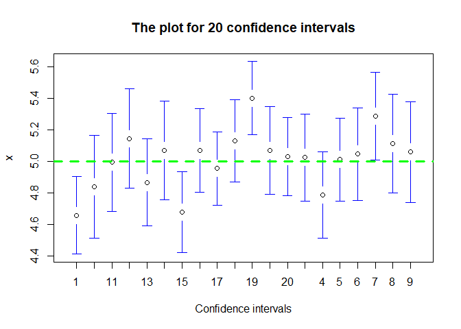

Confidence level test
================
2DoLLars

In statistics, a confidence interval(C.I) is a type of estimate computed
from the statistics of the observed data. This gives a range of values
for an unknown parameter (for example, a population mean). The interval
has an associated confidence level that gives the probability with which
an estimated interval will contain the true value of the parameter. In
this post, we conduct a simulation that empirically examine the meaning
of confidence level. And then we draw the plot of multiple confidence
intervals for understanding via visualization.

## Setting

We consider a normal random distribution *N*(5, 1) and set confidence
level by 0.95

``` r
iter = 10^4
n = 50
mu = 5
sd = 1
level = 0.95
```

## Calcualting the ratio of which C.I includes *μ*

We repeatedly get a random sample from *N*(5, 1) for different random
seeds. For each random sample, we check that the confidence interval
from the random sample includes true mean *μ* = 5. The resulting ratio
of which confidence interval includes *μ* is the almost same as
confidence level 0.95

``` r
result = rep(NA, iter)
for(i in 1:iter)
{
   set.seed(i)
   x = rnorm(n, mean = mu, sd = sd)
   t_value = qt(1 - (1 - level)/2, df = n - 1)
   ci_lower = mean(x) - t_value * sd(x) / sqrt(n)
   ci_upper = mean(x) + t_value * sd(x) / sqrt(n)
   result[i] = ( mu >= ci_lower ) & ( mu <= ci_upper)
}

ratio = mean(result)
print(paste0("The ratio of which C.I includes mu : ", ratio))
```

    ## [1] "The ratio of which C.I includes mu : 0.9521"

## Plot for confidence intervals

From the plot of multiple confidence intervals, we can see that 3
confidence intervals fails to include *μ* = 5

``` r
library(gplots)
```

    ## 
    ## 다음의 패키지를 부착합니다: 'gplots'

    ## The following object is masked from 'package:stats':
    ## 
    ##     lowess

``` r
set.seed(10)
x = c()
interval = c()
for(i in 1 : 20)
{
   x = c(x, rnorm(n, mean = mu, sd = sd))
   interval = c(interval, rep(as.character(i), n))
}
interval = as.factor(interval)

plotmeans(x ~ interval,
          connect = FALSE,
          n.label = FALSE,
          xlab = "Confidence intervals",
          ylab = "x",
          main = "The plot for 20 confidence intervals")
abline(h = mu, col = "green", lwd = 3, lty = 2)
```

<!-- -->
